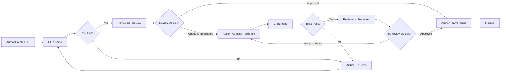

# Core Concepts

This page explains the fundamental concepts behind Ready-to-Review. Understanding these concepts will help you use the system effectively and troubleshoot issues.

## Turn-Based PR Tracking

Ready-to-Review tracks whose turn it is to act on a pull request. The system identifies specific actions that need to happen and who should take them, enabling multiple people to move a PR forward simultaneously.

### How It Works

The system analyzes each PR to determine:

1. **What actions are needed** - Specific tasks to move the PR forward
2. **Who can take each action** - Which people are responsible
3. **Which actions are critical** - What's blocking vs what's optional
4. **Multiple paths forward** - When several people can help

### Action Types

Ready-to-Review identifies these specific actions:

**Author Actions:**

- **Publish draft** - Mark PR as ready for review
- **Fix tests** - Fix failing CI checks or tests
- **Resolve conflicts** - Fix merge conflicts
- **Address feedback** - Respond to review comments and requested changes
- **Request reviewers** - Assign reviewers to the PR

**Reviewer Actions:**

- **Review** - Provide initial code review
- **Re-review** - Review changes after author updates
- **Approve** - Formally approve the PR

**Merge Actions:**

- **Merge** - Merge the approved PR

### Critical vs Non-Critical Actions

Not all actions are equally important:

- **Critical actions** block the PR from progressing (e.g., fixing failing tests, addressing requested changes)
- **Non-critical actions** are helpful but don't block (e.g., reviewing when the author still has work to do)

The dashboard and notifications prioritize critical actions to help you focus on what's blocking progress.

### Multiple Paths Forward

Often, multiple people can move a PR forward:

**Parallel Reviewers**: When multiple reviewers are assigned, **any one** can provide feedback to unblock the author. All reviewers see this as a critical action.

**Merge Escalation**: When a PR is approved and ready to merge, responsibility escalates over time:
- Initially: Author and assignees
- After 1 hour: Approvers
- After 7 hours: All participants with write access

**Unresolved Discussions**: Both author and reviewers may need to respond to move the conversation forward.

!!! info "What Ready-to-Review Analyzes"
    The system determines actions by analyzing:

    - CI check status (passing, failing, pending)
    - Review status (approved, changes requested, comments)
    - Merge conflicts
    - Draft status
    - Unresolved comment threads
    - Time since last activity
    - Repository permissions

### Example Flow

Here's how a typical pull request progresses:

1. **Author creates PR**: New pull request is opened
2. **CI Running**: Tests run (no action needed yet)
3. **Tests fail**: Author gets critical action "Fix tests"
4. **Tests pass**: All assigned reviewers get critical action "Review" (any one can provide feedback)
5. **Changes requested**: Author gets critical action "Address feedback"
6. **Author updates**: CI runs again, reviewers wait
7. **Tests pass**: Reviewers who requested changes get critical action "Re-review"
8. **Approved**: Author/assignees get critical action "Merge" (escalates to more people over time)
9. **Merged**: PR is closed

Throughout this flow, **multiple people may have actions simultaneously**, but the system clearly identifies which actions are critical for each person.

## Smart Notification Logic

Ready-to-Review doesn't just blast notifications to everyone. It uses intelligent logic to notify the right person at the right time.

### Notification Timing

Notifications are sent when:

- **State changes**: PR moves from one state to another (e.g., CI passes, review submitted)
- **Assignment changes**: New reviewers are added or removed
- **Significant time has passed**: Daily reminders if a PR has been waiting >8 hours

Notifications are **not** sent when:

- **PR is in waiting state**: Nobody needs to act (CI running, approved but not merged)
- **User recently notified**: Anti-spam protection prevents duplicate notifications within 1 minute
- **User just took action**: If you just pushed code, you won't be immediately notified about CI running

### Notification Channels

Ready-to-Review can notify via multiple channels. You choose which to enable:

| Channel | Notification Type | When to Use |
|---------|-------------------|-------------|
| **Dashboard** | Always available | Always enabled - check anytime at `<org>.ready-to-review.dev` |
| **Slack DM** | Direct message | User isn't in the channel where PR was posted |
| **Slack Channel** | Channel message | PR affects team or specific project |
| **Goose Desktop** | Native OS notification | Individual developer preference |

### Channel Priority

If multiple notification channels are enabled, Ready-to-Review uses this logic:

1. **Slack channel notification** (if user is in the channel):
    - Post to channel
    - **Wait 65 minutes** before sending reminder DM (configurable)
    - If user doesn't act within 65 minutes, send reminder DM
    - Dashboard always shows PR status

2. **Slack DM** (if user is not in the channel):
    - Send DM immediately
    - Dashboard always shows PR status

3. **Goose desktop notification**:
    - Sent simultaneously with Slack notifications (if Goose is installed)
    - Independent of Slack channel delay

4. **Dashboard only**:
    - If Slack and Goose are not configured, PRs appear in dashboard only
    - No active notifications

!!! tip "Reminder DMs"
    The 65-minute Slack DM is a reminder for people who missed the initial channel notification or were busy at that time. This ensures reviewers don't miss important PRs while avoiding immediate notification spam for those actively monitoring channels.

## Reviewer Assignment Algorithm

The GitHub Reviewer Bot automatically assigns reviewers to new pull requests using a multi-factor algorithm.

### Assignment Factors

Reviewers are scored based on:

1. **Code Ownership** (highest weight):
    - Who last modified the files being changed?
    - Who contributed most to the changed files historically?

2. **Current Workload** (second highest weight):
    - How many open PRs is this person currently reviewing?
    - Are any of those PRs stale (>90 days old)?
    - Reviewers with >9 active PRs are excluded

3. **Activity Patterns** (third highest weight):
    - Is the reviewer currently in their active work hours?
    - Have they been active on GitHub recently?
    - Are they on vacation or out of office?

4. **Expertise** (moderate weight):
    - Do they have domain expertise in the affected code?
    - Have they reviewed similar changes before?

!!! note "Bot Detection"
    The algorithm automatically filters out:

    - Service accounts (e.g., `dependabot`, `renovate`)
    - GitHub Apps and bots
    - Organization accounts (e.g., `@company`)
    - Inactive or deleted users

### Assignment Process

When a new pull request is created:

1. **Analyze changes**: Determine which files were modified
2. **Find contributors**: Use `git blame` to identify who last touched those files
3. **Score candidates**: Assign scores based on factors above
4. **Filter overloaded**: Remove reviewers with too many open PRs
5. **Select top reviewers**: Choose 1-3 reviewers with highest scores
6. **Assign on GitHub**: Add reviewers to the PR
7. **Notify**: Send notifications via configured channels

### Workload Balancing

To prevent reviewer burnout, the algorithm:

- **Excludes** reviewers with >9 non-stale open PRs
- **Counts only recent PRs** - PRs untouched for >90 days are considered stale
- **Distributes load** - if multiple candidates have similar scores, picks the one with fewer open PRs

!!! example "Workload Calculation"
    Alice has 12 open PRs assigned:

    - 3 PRs updated within 90 days (not stale)
    - 9 PRs not updated for >90 days (stale)

    Effective workload: **3 PRs** (stale PRs are ignored)

    Alice is eligible for new assignments.

## Timezone Awareness

Ready-to-Review detects user timezones and schedules notifications during active work hours when possible.

### How Timezone Detection Works

Timezones are detected using:

1. **GitHub activity patterns**: When is this user most active?
2. **Profile analysis**: Does the user's profile list a location?
3. **Commit timestamps**: What timezone are commits made from?
4. **Default**: If timezone cannot be detected, UTC is assumed

### Timezone in Action

**Daily Reminders**: Sent between 8-9am in the user's local timezone

!!! example
    - Alice (US Eastern): Reminded at 8:30am ET
    - Bob (Central Europe): Reminded at 8:15am CET
    - Carol (Tokyo): Reminded at 8:45am JST

**Reviewer Assignment**: Reviewers in active timezones are slightly prioritized over those who are likely offline

## Technical Architecture

For a deep dive into how Ready-to-Review's state machine, notification system, and microservices interact, see the [architectural diagram](https://github.com/codeGROOVE-dev/architecture/blob/main/README.md).

## Next Steps

Now that you understand core concepts:

- Configure your [Dashboard](dashboard.md) view preferences
- Set up [Slack Integration](slack.md) channel mappings
- Install [Goose](goose.md) for desktop notifications
- Learn how [GitHub Reviewer Bot](github-bot.md) assigns reviewers
